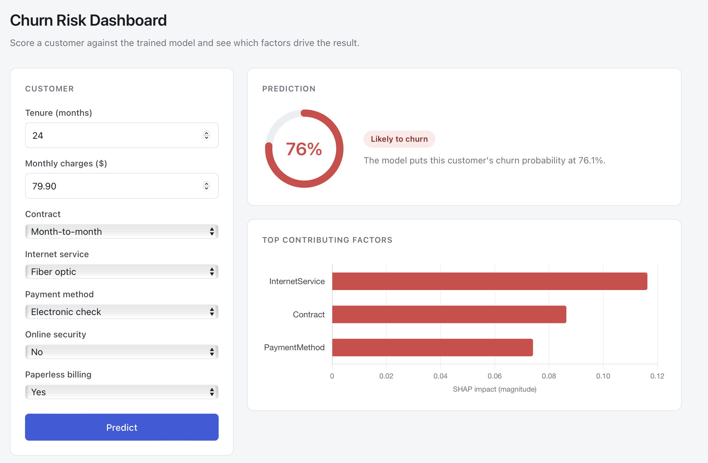

# Churn Risk Dashboard

A customer churn prediction service: a tuned scikit-learn pipeline behind a FastAPI
endpoint, with a dashboard that shows not just *whether* a customer is likely to
leave but *which factors* pushed the model to that answer.



## What it does

Send it a customer and it returns a churn probability plus the three features that
moved the prediction most, via SHAP:

```json
{
  "churn_probability": 0.7611702883107244,
  "will_churn": true,
  "threshold": 0.3,
  "top_factors": [
    { "feature": "InternetService", "impact": 0.1162, "direction": "increases risk" },
    { "feature": "Contract",        "impact": 0.0863, "direction": "increases risk" },
    { "feature": "PaymentMethod",   "impact": 0.074,  "direction": "increases risk" }
  ]
}
```

The explanation is the point. A bare probability tells you a customer is at risk; the
factor breakdown tells you month-to-month billing and fiber service are why, which is
the part someone can act on.

## Quick start

Requires Python 3.9+.

```bash
pip install -r requirements.txt
python model/train.py          # writes model/churn_model.pkl
uvicorn main:app --port 8000
```

Then open **http://127.0.0.1:8000/app**.

`train.py` has to run first — the trained pipeline is a 11MB binary and is gitignored,
so it isn't in the repo. It runs a grid search, so give it a couple of minutes.

### With Docker

```bash
docker build -t churn-service .
docker run --rm -p 8000:8000 churn-service
```

Same URL. The build copies `model/churn_model.pkl` into the image and fails early with
a clear message if you haven't trained yet.

## Endpoints

| Route | What it is |
|---|---|
| `/app` | The dashboard |
| `/predict` | `POST` a customer, get a probability and SHAP factors |
| `/docs` | Swagger UI — try `/predict` from the browser |
| `/health` | `{"status": "healthy"}` |

### `POST /predict`

All seven feature fields are required. The categoricals are typed as literals, so
anything outside the allowed set comes back as a `422` naming the offending field.
`threshold` is optional — omit it to use the cost-minimising default described below.

```json
{
  "tenure": 24,
  "MonthlyCharges": 79.90,
  "Contract": "Month-to-month",
  "InternetService": "Fiber optic",
  "PaymentMethod": "Electronic check",
  "OnlineSecurity": "No",
  "PaperlessBilling": "Yes"
}
```

| Field | Type | Allowed values |
|---|---|---|
| `tenure` | int | months |
| `MonthlyCharges` | float | dollars |
| `Contract` | str | `Month-to-month`, `One year`, `Two year` |
| `InternetService` | str | `DSL`, `Fiber optic`, `No` |
| `PaymentMethod` | str | `Electronic check`, `Mailed check`, `Bank transfer (automatic)`, `Credit card (automatic)` |
| `OnlineSecurity` | str | `Yes`, `No`, `No internet service` |
| `PaperlessBilling` | str | `Yes`, `No` |
| `threshold` | float | *optional*, 0 < t < 1 — overrides the default decision threshold |

## The model

Trained on the [Telco Customer Churn dataset](https://www.kaggle.com/datasets/blastchar/telco-customer-churn)
— 7,043 customers, 26.5% of whom churned.

Of the 21 available columns it uses seven, chosen from the feature importances of a
first pass. Fewer inputs means a form a human will actually fill in, at a cost in
accuracy that's small relative to what usability buys.

Everything lives in one `Pipeline`, so the encoder, the scaler and the classifier are
fitted together and saved as a single artifact — no chance of the API scaling inputs
differently than training did:

- `StandardScaler` on `tenure` and `MonthlyCharges`
- `OneHotEncoder(drop='first', handle_unknown='ignore')` on the five categoricals
- `RandomForestClassifier(class_weight='balanced')`, tuned by `GridSearchCV` over
  `n_estimators` and `max_depth` against ROC-AUC

`class_weight='balanced'` matters here: at a 73/27 split, an unweighted model can score
well on accuracy while barely catching the customers you care about.

### Results

Measured on a held-out test set of 1,409 customers (20% of the data), before and after
the grid search:

| Metric | Baseline | Tuned |
|---|---|---|
| Accuracy | 0.7800 | 0.7793 |
| Precision | 0.6026 | 0.5610 |
| Recall | 0.4960 | **0.7641** |
| F1 | 0.5441 | 0.6470 |
| ROC-AUC | 0.8054 | **0.8559** |

Accuracy didn't move. Recall went from 0.50 to 0.76.

That trade is the whole point, and it's why accuracy is the wrong number to tune on
here. The baseline model missed half the customers who actually left. The tuned model
catches three quarters of them, paying for it with precision — 0.60 down to 0.56, so
more customers get flagged who would have stayed anyway. For churn that's the right
direction: a retention offer sent to someone who wasn't leaving costs a discount, while
a customer who leaves unnoticed costs the whole account.

Selected by `GridSearchCV` on ROC-AUC: `max_depth=10`, `n_estimators=200`, best CV
score 0.8368. Five-fold cross-validation on the untuned pipeline gives ROC-AUC
0.799 ± 0.013, so the fold-to-fold spread is small.

By feature importance, `tenure` (0.31) and `MonthlyCharges` (0.22) dominate, followed by
a two-year contract (0.12) and fiber service (0.09).

Run `python model/train.py` to reproduce all of it — classification reports, the
confusion matrix and the per-fold scores print to stdout. It's seeded with
`random_state=42`, so the numbers above come out identical.

### Choosing the decision threshold

`predict()` defaults to flagging anything above 0.5, which quietly assumes a false
positive and a false negative cost the same. In churn they don't: an unnecessary
retention offer costs a discount, while a customer who leaves unnoticed costs the whole
account. `train.py` therefore sweeps every threshold from 0.01 to 0.99 and picks the one
that minimises expected cost at a 5:1 ratio, writing it to `model/threshold.json` for
the API to load.

| Threshold | Precision | Recall | Flagged | Expected cost |
|---|---|---|---|---|
| 0.20 | 0.4092 | 0.9544 | 870 | 599 |
| **0.30** | **0.4663** | **0.9088** | **727** | **558** |
| 0.40 | 0.5081 | 0.8418 | 618 | 599 |
| 0.50 *(default)* | 0.5610 | 0.7641 | 508 | 663 |
| 0.70 | 0.6700 | 0.5389 | 300 | 959 |

Moving from 0.50 to 0.30 lifts recall from 0.76 to **0.91** and cuts expected cost by
**15.8%**. It costs precision — 0.56 down to 0.47 — and flags 219 more customers, which
is the honest trade: catching 43 more of the ones who actually leave means reaching out
to people who would have stayed.

The cost ratio is two constants at the top of `train.py`. Change them and the chosen
threshold moves with them, which is the point — the number isn't a magic constant, it's
the output of an assumption you can state and argue with.

Callers can override it per request with an optional `threshold` field, and every
response reports the value it applied.

## Project layout

```
.
├── main.py              FastAPI app: /predict, /health, and the dashboard mount
├── model/
│   ├── train.py         trains, tunes, evaluates, picks the threshold, saves
│   ├── churn_model.pkl  the fitted pipeline (gitignored — run train.py)
│   ├── threshold.json   cost-minimising decision threshold
│   └── WA_Fn-UseC_-Telco-Customer-Churn.csv
├── frontend/
│   └── index.html       the dashboard: plain HTML/CSS/JS, Chart.js from a CDN
├── tests/               pytest suite
├── .github/workflows/   CI: train, test, build, smoke-test the container
├── docs/
├── Dockerfile
├── .dockerignore
└── requirements.txt
```

The dashboard is deliberately dependency-free — no framework, no build step, no
`node_modules`. FastAPI serves it as a static file, so the page and the API share an
origin and `fetch` can just call `/predict`.

## Tests

```bash
pip install -r requirements-dev.txt
pytest
```

33 tests covering the API contract, the threshold logic and the model artifact. The ones
worth knowing about:

- **SHAP attribution** — every encoded column must resolve back to a real input feature.
  Includes a regression test for a bug where splitting `cat__Contract_Two year` on the
  first underscore silently mis-grouped any feature name containing one, so a future
  `Tech_Support` column would have been attributed to a feature called `Tech`.
- **Pickle compatibility** — asserts the pipeline unpickles and exposes all 12 encoded
  columns, catching the scikit-learn version drift described below before it reaches a
  container.
- **Threshold behaviour** — that the API honours the trained threshold rather than 0.5,
  that an override flips the verdict without moving the probability, and that the
  threshold field never leaks into the model's feature columns.
- **Schema rejection** — each of the five categorical fields is parametrised to confirm
  a bad value returns `422` naming the offending field.

GitHub Actions runs the whole chain on every push and pull request: install, train the
model, run the tests, build the Docker image, then start the container and hit
`/health` and `/predict` against it.

## A note on the pinned dependencies

`requirements.txt` pins exact versions, and that isn't incidental tidiness.
`churn_model.pkl` is a scikit-learn pickle, and scikit-learn 1.9 cannot load one
written by 1.6:

```
AttributeError: Can't get attribute '_RemainderColsList' on
<module 'sklearn.compose._column_transformer'>
```

The symbol was removed, so the `ColumnTransformer` fails to unpickle and the service
won't start. If you bump scikit-learn, re-run `model/train.py` so the artifact matches
the version that has to load it.
